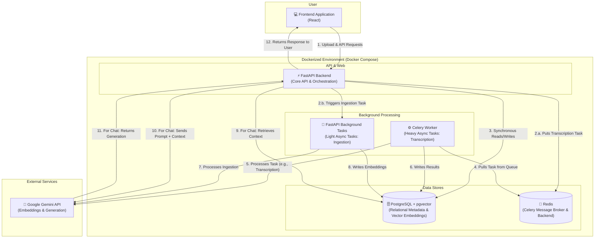

# Technical Architecture: RAG Office Portal

## 1. Executive Summary
This document outlines the architecture for the Office Portal, a system designed to ingest documents and meeting transcripts, process them through a Retrieval-Augmented Generation (RAG) pipeline, and provide AI-powered chat and search capabilities. The architecture is fully containerized using Docker and relies on a set of interconnected services for handling web requests, background processing, and data storage.

---

## 2. High-Level Architecture Diagram

The following diagram illustrates the major components of the system and the flow of data between them.

---

## 3. Component Breakdown

### 3.1. Frontend (`React`)
*   **Description:** A single-page application (SPA) that provides the user interface for all functionalities, including file upload, chat, and administration.
*   **Responsibilities:**
    *   Render the UI.
    *   Handle user authentication.
    *   Make API calls to the FastAPI backend.

### 3.2. Backend (`FastAPI`)
*   **Description:** The central API server that orchestrates all application logic.
*   **Responsibilities:**
    *   Provides RESTful endpoints for the frontend.
    *   Manages users, roles, and permissions.
    *   Handles synchronous operations like user login and chat requests.
    *   Offloads long-running and heavy asynchronous tasks (like audio transcription) to the Celery worker via Redis.
    *   Initiates lighter asynchronous tasks (like document ingestion) using its built-in `BackgroundTasks` feature.
    *   Interacts directly with the database for storing and retrieving relational data and vectors.

### 3.3. Celery Worker
*   **Description:** A dedicated background process that consumes and executes tasks from the Redis message queue.
*   **Responsibilities:**
    *   Handles computationally expensive and time-consuming jobs, such as `transcribe_audio_task` and `generate_minutes_task`.
    *   Ensures the API server remains responsive by processing heavy tasks separately.
    *   Interacts with external APIs (Gemini) and writes results to the PostgreSQL database.

### 3.4. Data Stores
*   **PostgreSQL with `pgvector`:**
    *   **Description:** The primary database for the application.
    *   **Usage:**
        *   **Relational Data:** Stores structured data like users, roles, document metadata, and chat history.
        *   **Vector Data:** The `pgvector` extension allows it to store and efficiently query high-dimensional vector embeddings, making it the single source of truth for the RAG pipeline's knowledge base. It replaces the need for a separate, dedicated vector database like Qdrant or Milvus.
*   **Redis:**
    *   **Description:** An in-memory data structure store.
    *   **Usage:**
        *   **Celery Broker:** Acts as the message broker, holding the queue of tasks to be processed by the Celery workers.
        *   **Celery Backend:** Stores the results and state of completed Celery tasks.

### 3.5. External Services (`Google Gemini API`)
*   **Description:** The external Large Language Model (LLM) service.
*   **Usage:**
    *   **Embedding:** The `gemini-embedding-001` model is used to convert text chunks into vector embeddings for storage and similarity search.
    *   **Text Generation:** A generative model is used to provide responses in the chat interface based on user queries and retrieved context.

## 4. Key Workflows

### 4.1. Document Ingestion
1.  A user uploads a document via the **React** frontend.
2.  The frontend sends the file to the **/api/ingest** endpoint on the **FastAPI backend**.
3.  The backend saves the file, creates a `Document` record in **PostgreSQL**, and triggers the `ingest_document_pipeline` function using its internal `BackgroundTasks`.
4.  This background task reads the document, cleans and chunks the text, calls the **Gemini API** to generate embeddings, and saves the `DocumentChunk` records (including embeddings) back to **PostgreSQL**.

### 4.2. Audio Transcription
1.  A user uploads an audio file via the **React** frontend to the **/api/transcribe** endpoint.
2.  The **FastAPI backend** creates a `TranscriptionJob` record in **PostgreSQL** and dispatches a `transcribe_audio_task` to the **Redis** message queue.
3.  A **Celery Worker** picks up the task from Redis.
4.  The worker processes the audio file (potentially using an external API or library) and updates the job status and result in **PostgreSQL**.

### 4.3. RAG Chat
1.  A user sends a message through the **React** chat interface.
2.  The **FastAPI backend** receives the message.
3.  It generates an embedding for the user's query using the **Gemini API**.
4.  It performs a vector similarity search in **PostgreSQL (`pgvector`)** to find relevant document chunks.
5.  It constructs a prompt containing the original query, chat history, and the retrieved chunks.
6.  This prompt is sent to the **Gemini API** for generation.
7.  The AI's response is saved to the chat history in **PostgreSQL** and sent back to the user's browser.
