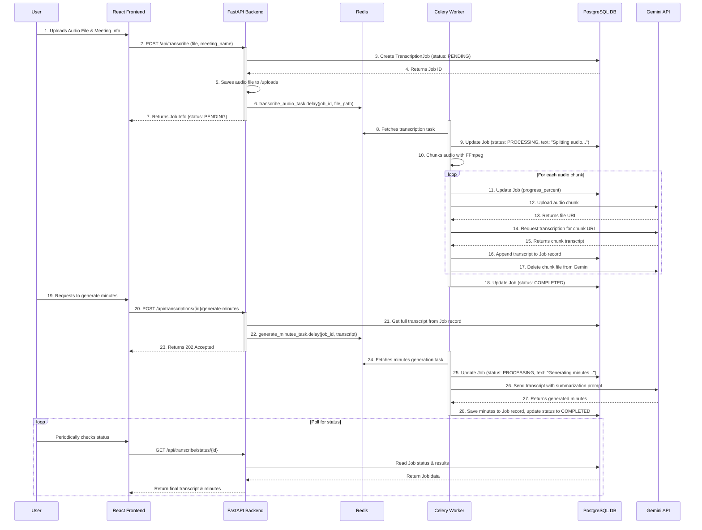
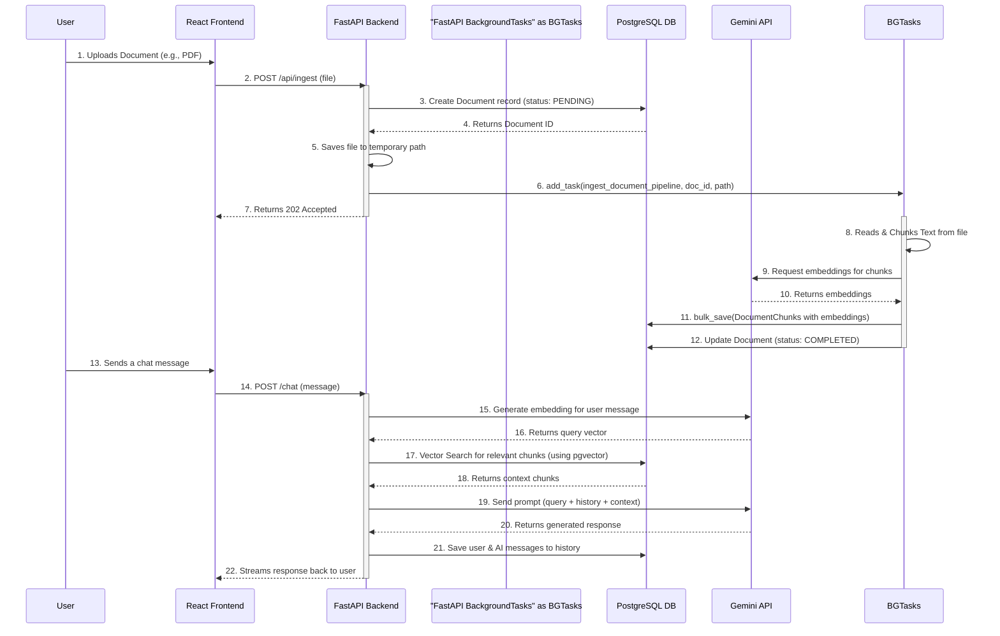

# Application Sequence Diagrams

This document contains sequence diagrams illustrating the key workflows in the Office Portal application.

---

## 1. Audio Transcription & Minutes Generation Workflow

This diagram shows the end-to-end process from a user uploading an audio file to generating meeting minutes. It involves all major components of the architecture: the frontend, the API backend, the database, the Redis message queue, the Celery worker for heavy lifting, and the external Gemini API.

---

## 2. Document Ingestion & RAG Chat Workflow

This diagram illustrates the two core parts of the RAG (Retrieval-Augmented Generation) system: ingesting a new document and using the knowledge base in a chat conversation.

